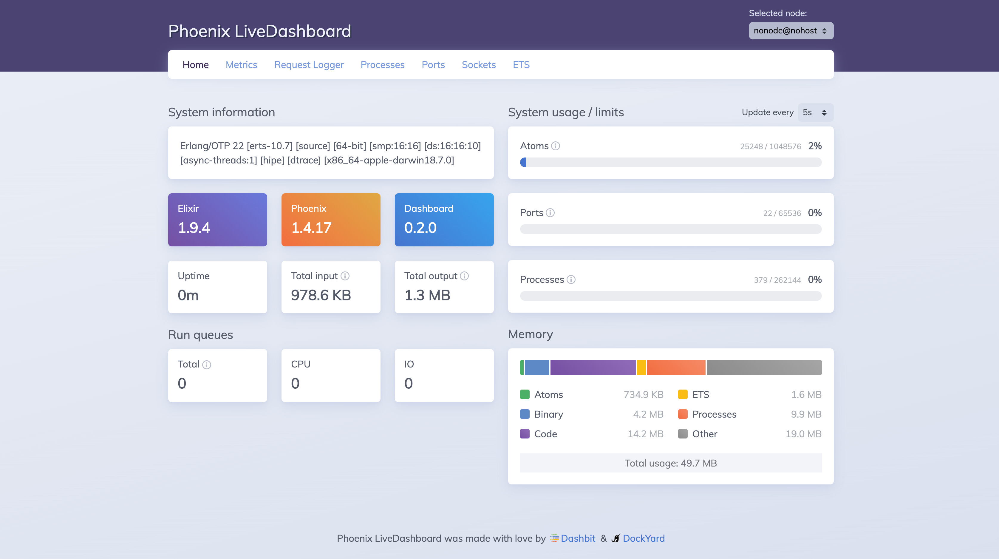
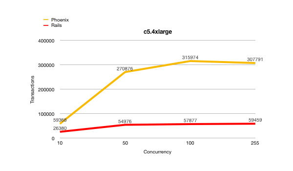

For the last eight odd years, I have used a wide array of languages to develop back end applications across various specialties. I spent the first few years of my backend development career indulging the immensely popular web language, PHP. For a language to begin learning backend development, it was great. There was lots of support for issues, plenty of applications are using PHP, creating simple scripts is easy, and it had been around for a while, so it is mature. Although, after a while, I got tired of poor error handling, weak typing and subpar security, this led me to seek alternatives.

The search led me to NodeJS, a relatively new framework using JavaScript that was scalable, easy to learn and showed high-performance capabilities. NodeJS brought a high level of horizontal scalability whereby an application can handle more work by adding hardware resources and adding more nodes. Despite the fact, due to its single-threaded architecture, its ability to scale vertically is limited, forcing horizontal scaling. On a code level, I found that the shift from PHP was seamless as I already knew JavaScript for use in front end web apps, adapting to using it as a backend was simple. The active and growing community at the time was a huge bonus, and to be able to use regular JavaScript libraries as well as Node specialised ones made it the optimal choice. It was those aspects that made it my backend of choice for a large portion of the last few years, in spite of this, all good things must come to an end. After a while, I found that JavaScript and NodeJS' unstructured nature made its Application Programming Interface unsuitable and kind of awkward at times. The asynchronous programming model was a bit clunky and resulted in many nested calls and especially when some libraries forced the error-first function callbacks over promises. Asynchronous programming has been significantly improved now in ES7 with the introduction of async/await, but by this point, it was too late. The need for computation heavy, multi-threaded and CPU intensive tasks lead me away from using NodeJS for more complex projects.

Once again, I was on the search for my next backend language. I read blog posts, articles, watched YouTube videos, and it all resulted in mixed opinions and more confusion. Although, something stood out, Python as a web backend. I had used Python for other projects in the past but never had considered it as a web backend. There are two Python frameworks that I tried, Django and Flask. Django is a full start-to-finish framework, meaning it has everything from a directory structure to a comprehensive admin panel and ORM (Object Relation Mapping). Django is robust, secure and doesn't rely on third-party software to do the heavy lifting. Flask, on the other hand, is a far more lightweight framework that supplies basic web application features such as routing and error handling. Flask allows for more control over how projects are structured, and Flask has a more plug-and-play ecosystem. Both of these frameworks offered a high level of security and secure authentication systems. As I moved away from SQL databases to NoSQL databases such as MongoDB and graph databases, I found it extremely difficult to use Django due to its ORM; this shifted me towards the open-ended Flask framework. Finally, I had found it, the backend solution that would serve me for years. Or so I thought.

After adopting Flask and developing tools around it, I only ended up using it for about a year before my thirst for something new came back. While Python is a much better language to use than PHP and JavaScript, it has some fundamental flaws when being deployed as a web backend. The first and most crucial being that for large applications, it simply isn't scalable. If developed incorrectly, an application can have serious stability issues in a production environment. Python was not initially designed for web applications; it was made for computational work, so we have merely adapted it. As I began to strive for more reliability, performance and just a better development experience, I was on the hunt once again and hopefully for the last time, well, at least for now.

## How I found Elixir, and what is it?

I first learnt about Elixir while browsing the web when I stumbled across a post on the Discord developer blog. The post described how Elixir enabled Discord to scale to millions of concurrent connections and achieve extremely fast speeds. Up until that point, Elixir was not even on my radar, but I was interested in learning more.

Elixir was initially developed by José Valim in 2012 and released to the public with version 1.0 in 2014[^1]. Valim came from the Ruby on Rails ecosystem, where he was a regular contributor to the Rails project, but was tired of OOP (Object Oriented Programming), among other issues with Ruby, and decided to build upon the powerful Erlang libraries. It is because of this that a large part of Elixir looks and feels like Ruby, hence a lot of the Elixir community came from Ruby.

In case you're interested in the discord developer blog post I read, you can find it here [How Discord Scaled Elixir to 5,000,000 Concurrent Users](https://blog.discord.com/scaling-elixir-f9b8e1e7c29b?gi=7599a254a985).

## So what makes Elixir so great?

**Disclaimer:** Many of the listed features are not exclusive to Elixir and may be part of Erlang/BEAM VM, but for the intent of showcasing Elixir they are bundled together.

### It's a Functional Language

Elixir is a functional programming language and is one of a handful of programming languages that are bringing back functional programming[^2]. Functional languages have a clear and approachable syntax, pure functions, lazy evaluation and better readability, just to name a few. In the words of the [Elixir language homepage](https://elixir-lang.org/) "functional programming promotes a coding style that helps developers write code that is short, concise, and maintainable".

```elixir
iex> %Blog{title: title, subtitle: subtitle} = Blog.get_latest()
iex> title
"My Blog"
```

Unthinkable software wrote an excellent post on [the advantages of functional programming](https://medium.com/@devisha.singh/7-unbeatable-advantages-of-functional-programming-b5d1af1edbe1).

### Pattern Matching

One of my absolute favourite parts of Elixir is pattern matching, a powerful tool in assigning data and conditional matching. Pattern matching provides iron clad conditions that will fail fast, and when used in function parameters, they are extremely powerful. Pattern matching in functions allows for definite clauses and prevents a lot of if statements everywhere.

```elixir
def msg_for_type(_conn, :not_authenticated), do: "You are not authenticated."
def msg_for_type(_conn, :already_authenticated), do: "You are already logged in."
def msg_for_type(conn, type) do
	conn.get_msg(type)
end
```

Unlike in other languages, there is no need for a load of if statements to achieve the same outcome.

### Immutable data structures

Another benefit of being a functional language over an object-oriented language is the immutable data structures. These data structures mean that once created, a variable cannot be changed and when you change a value in the data structure that is creating a new copy of the data. Elixir does, however, allow rebinding of data for convenience. Rebinding helps large systems to be maintainable and more natural to debug issues.

### Concurrency and Scalability

Elixir is built upon the Erlang VM (BEAM), making concurrency easy to implement. Code runs in threads called processes (not to be confused with system processes) that communicate with each other through message passing.

```elixir
defmodule Calculator do
	def multiply(a, b) do
		a * b
	end

	def listen do
		receive do
			{:ok, "Hello"} -> "World"
		end

		# Recursively call function
		listen()
	end
end

# Run function syncronously
iex> Calculator.multiply(4, 5)
20

# Spawn a process to run function asyncronously
iex> spawn(Calculator, :multiply, [4, 5])
20
#PID<0.40.0>

# Spawn listen process
iex> pid = spawn(Calculator, :listen, [])
#PID<0.64.0>

# Send a message to the process with matching clause
iex> send pid, {:ok, "Hello"}
"World"
{:ok, "Hello"}

# Send a message to the process without matching clause
iex> send pid, :ok
:ok
```

### Awesome development tools

The build tools in Elixir are unlike any other. The mix build tool is the most popular tool to create projects, manage tasks and run tests. The hex package manager is capable of managing dependencies, fetch remote packages and host documentation.

```bash
$ mix new my_project
$ cd my_project
$ mix test
.

Finished in 0.06 seconds (0.06s on load, 0.00 on tests)
1 tests, 0 failures
```

### Fault tolerance

Most languages try to avoid errors at all costs, but Elixir chooses to embrace them and adopts the *fail-fast* methodology. To achieve this, Elixir provides supervisors that control how parts of the system restart when things inevitably fail. Problems are solved by returning failed components of the system to an initial working state.

```elixir
children = [
	# Start the Telemetry supervisor
  MyAppWeb.Telemetry,
  # Start the Endpoint (http/https)
  MyAppWeb.Endpoint
]

opts = [strategy: :one_for_one, name: MyAppWeb.Supervisor]
Supervisor.start_link(children, opts)
```

### Hot Swapping Code

Hot Swapping Code (also known as hot plugging) allows for replacing of components in a system without stopping the whole system. Hot swapping is extremely useful in production environments when elements of a system need to be updated, but you cannot afford to shut down the entire system. In most other languages such as Python, entire nodes must be taken down and updated one at a time which can cause issues.

### Performance

Elixir's high concurrency and reliable performance make it optimal for production-ready systems from day one. The following image is from a [Stessgrid blog post](https://stressgrid.com/blog/benchmarking_go_vs_node_vs_elixir/) where it compares Elixir with GoLang performance where it maintained a near-constant performance throughout the test. In contrast, GoLang slowed after about 70k concurrent connections.


Although Elixir has great performance metrics, it does start to break down in heavy computational work due to its immutable data structures. Thankfully Elixir data structures work nicely in Rust, and it can, therefore, be used alongside Elixir. The power of Rust and Elixir used together utilizes each of their strengths. The developers over at Discord encountered this very issue: [Using Rust to Scale Elixir for 11 Million Concurrent Users](https://blog.discord.com/using-rust-to-scale-elixir-for-11-million-concurrent-users-c6f19fc029d3?gi=8d813d139dea). Another example of the benefits of both worlds can be found here: [When Elixir's Performance Becomes Rust-Y](https://www.theguild.nl/when-elixirs-performance-becomes-rust-y/).

### Documentation

HexDocs is a one-stop-shop for all Elixir package documentation. If done correctly, typing and documentation in code is automatically converted and displayed in a friendly, readable static website for internal or external use. Documentation is all done by a package called [ExDoc](https://github.com/elixir-lang/ex_doc), which can automatically add examples in your documentation to your unit tests. For example, check out the [official Elixir docs](https://hexdocs.pm/elixir).

## Ok. But what about web

Like Python has Flask and Django, Elixir has Phoenix (among other frameworks but Phoenix is the go-to). Phoenix was designed to "provide highly performant and scalable web applications". It is developed and maintained mainly by Chris McCord from [DockYard](https://dockyard.com/). Phoenix is very new, and I mean **VERY NEW**. Phoenix only reached 1.0 status in 2018, because of this it does not have as wide a userbase as some of the other frameworks previously mentioned. Despite this, it is quite a mature framework for its age and has many unique and powerful features.

### Plugs

Plugs are an awesome specification for the components of web applications. They act like middleware between the connection and your core business logic, allowing for easy to implement functionality like authentication guards or modifying a session.

```elixir
defmodule MyAppWeb.Plug.LoadUserIntoSession do
  import Plug.Conn

  def init(options), do: options

  def call(conn, _opts) do
    put_session(conn, :user, User.get(conn.assigns.user_id))
  end
end

defmodule MyAppWeb.Router do
  defmodule MyAppWeb.Router do
  use MyAppWeb, :router

  pipeline :browser do
    plug :accepts, ["html"]
    plug :fetch_session
    plug :fetch_live_flash
    plug :put_root_layout, {MyAppWeb.LayoutView, :root}
    plug :protect_from_forgery
    plug :put_secure_browser_headers

    # Load resource
    plug MyAppWeb.Plug.LoadUserIntoSession
  end
end
```

### Channels

Phoenix Channels are a simplified WebSocket implementation for real-time features. The core concept is bidirectional communication between clients and servers. Receivers subscribe to topics and senders broadcast messages to those topics. Channels are a combination of different components to implement real-time web features. 

```elixir
defmodule MyAppWeb.RoomChannel do
  use Phoenix.Channel

  def join("room:lobby", _message, socket) do
    {:ok, socket}
  end
  def join("room:" <> _private_room_id, _params, _socket) do
    {:error, %{reason: "unauthorized"}}
  end
end
```

```jsx
// Connect to socket
socket.connect()

// Join channel
let channel = socket.channel("room:lobby", {})
channel.join()
  .receive("ok", resp => { console.log("Joined successfully", resp) })
  .receive("error", resp => { console.log("Unable to join", resp) })

export default socket
```

### LiveView

Phoenix LiveView is relatively new to the framework but has made all backend developers as happy as can be. In the [developer's own words](https://dockyard.com/blog/2018/12/12/phoenix-liveview-interactive-real-time-apps-no-need-to-write-javascript):

> Phoenix LiveView is an exciting new library which enables rich, real-time user experiences with server-rendered HTML - Chris McCord

LiveView uses Phoenix Channels to simplify web applications by maintaining a stateful bidirectional WebSocket connection to the client. Throughout its development, its toolset has already progressed significantly and has become even more powerful. This powerful alternative will soon threaten traditional JavaScript client frameworks. Until then, for more complex web apps, I will still be using React and Angular.

Some exciting innovations earlier this year were released in Phoenix 1.5 and showcased in [Build a real-time Twitter clone in 15 minutes with LiveView and Phoenix 1.5](https://phoenixframework.org/blog/build-a-real-time-twitter-clone-in-15-minutes-with-live-view-and-phoenix-1-5).

### Live Dashboard

Introduced in Phoenix 1.5 was Live Dashboard as stock in the framework. The panel gives a visual representation of metrics, performance and real-time behavioural metrics. Live Dashboard gives developers a real-time look into resource usage and can be very useful in debugging issues when in production.



### Development speed

Developing web applications in Phoenix is comparable to other "batteries included" frameworks such as Django. Phoenix aims to help developers by allowing them to not worry about spending time on common tasks like sessions, headers and request forgery protection. Compared to the other languages and frameworks I have previously used, developing in Phoenix is a breeze.

### Ecto Models

Phoenix uses the Ecto library to represent data in models  which are in charge of defining schema fields and types. These models are represented as structs in the library. They can define relationships with other models and create "virtual" fields. Virtual fields are a useful tool as they are fields on a model that aren't persisted in the database. For example, virtual fields are handy when wanting to convert a password into a hash before saving it into the database. A virtual 'password' field could store the user-entered password, and a regular 'password_hash' field could store the hashed password. Using this method will ensure that you can still perform actions on a user and can use plain text passwords that won't be stored.

```elixir
defmodule MyApp.User do
  use MyApp.Web, :model

  schema "users" do
    field :first_name, :string
		field :last_name, :string
    field :email, :string
    field :password, :string, virtual: true
    field :password_hash, :string
  end
end
```

### Ecto Changesets

Changesets are a powerful way to track and validate changes to a model using explicit validations and transformations. Multiple changesets can be created, for example, one for registration and one for updating the user. This example could mean that a password must be supplied for registration but not for updating a user.

```elixir
defmodule MyApp.User do
  use MyApp.Web, :model

  schema "users" do
    field :first_name, :string
		field :last_name, :string
    field :email, :string
    field :password, :string, virtual: true
    field :password_hash, :string
  end

	def changeset(struct, params \\ %{}) do
    struct
    |> cast(params, [:first_name, :last_name, :email, :password])
    |> validate_required([:email, :password])
  end
end
```

### Performance

Phoenix is fast, and I mean fast! It's performance metrics are so impressive that I was honestly quite astonished when I first saw them. Instead of requests taking milliseconds (like in NodeJS with ExpressJS for example), requests take microseconds. While this might not seem like a big thing for a couple of connections, it makes a significant difference for tens of thousands of connections. When compared with arguably Phoenix's closest rival, Ruby on Rails, on average Phoenix performs 7x better than Rails. Check out the [original benchmarks](https://medium.com/@elviovicosa/phoenix-vs-rails-benchmark-2019-f0e68336d557).



For more on Phoenix's power, check out [The Road to 2 Million Websocket Connections in Phoenix](https://www.phoenixframework.org/blog/the-road-to-2-million-websocket-connections).

## What I don't like

### The small but growing community

Elixir is a very new language, and its community is still small, but it is growing. Compared to other languages mentioned earlier, such as Python, PHP and JavaScript, the community is much smaller. Likely because Elixir is a functional language, Elixir is believed by many to remain a niche language forever. However, functional programming languages are on the rise [again](https://medium.com/javascript-scene/the-rise-and-fall-and-rise-of-functional-programming-composable-software-c2d91b424c8c), so adoption rates of languages such as Elixir by experienced developers may become more common. The small community does mean that getting developer support may be more difficult. So be ready to read the documentation a lot and fix your own problems (sometimes feels like how it was before Stack Overflow existed).

There are signs of growth in the Elixir community, in the [2019 Stack Overflow developer survey](https://insights.stackoverflow.com/survey/2019), 68.2% of participants that use Elixir rated it as one of their most loved languages. Elixir was also listed as being in the top five highest-paid salaries. According to the survey "Developers who work with Rust, WebAssembly, and Elixir contribute to open source at the highest rates". The [Elixir GitHub](https://github.com/elixir-lang/elixir) has over 1k contributors, and the [Elixir Slack Channel](https://elixir-slackin.herokuapp.com/) has over 28k members.

### Smaller ecosystem

Since Elixir is a new and immature language, the ecosystem is incomplete, but it's getting there. While there are a lot of libraries available, there are many cases where the perfect library you need just doesn't exist yet so you'll have to build the library yourself. You are more likely to need to develop your own libraries if you are using niche technologies such as lesser-used APIs.

When I made the switch to ArangoDB (after another long journey but that's for another post), I found that the integration for ArangoDB with Ecto was outdated and incomplete so I had to redevelop it myself. The project can be found on [GitHub](https://github.com/TomGrozev/arangox_ecto), but I haven't used it in a large scale project yet, so I don't recommend using it until it reaches 1.0 status.

## Conclusion

Ultimately, I have tried many languages and frameworks over the past few years, each time looking for a better alternative. Elixir is a new, powerful language that has developed at a relatively rapid rate, and it has many powerful libraries that are already available within the ecosystem. The advantages that hooked me onto the language vastly overshadow the disadvantages of the developing community and ecosystem.

Functional programming, concurrency, scalability, pattern matching and fault tolerance are what brought me Elixir, and the features of Phoenix are what made me stay. Elixir has become my go-to choice for projects that need fast prototyping, high performance, future-ready, scalability and fault tolerance. Many companies are using Elixir and Erlang in their development stacks, such as Discord, Pinterest, WhatsApp and Bet365. Therefore, if you want to try a new language that may solve your programming nightmares, give Elixir a try. You can get started by following the [tutorials on the main Elixir website](https://elixir-lang.org/getting-started/introduction.html). Also check out some of the cool things with Elixir [here](https://github.com/h4cc/awesome-elixir).
 
[^1]: [https://elixir-lang.org/development.html](https://elixir-lang.org/development.html)
[^2]: [https://sreekar.ch/2019/05/28/return-of-functional-programming.html](https://sreekar.ch/2019/05/28/return-of-functional-programming.html)
